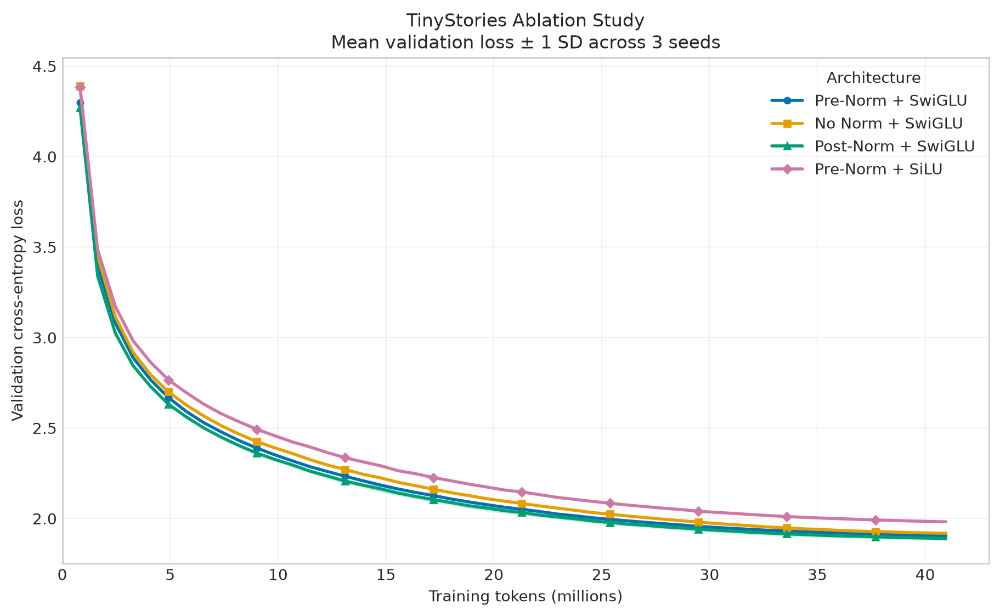
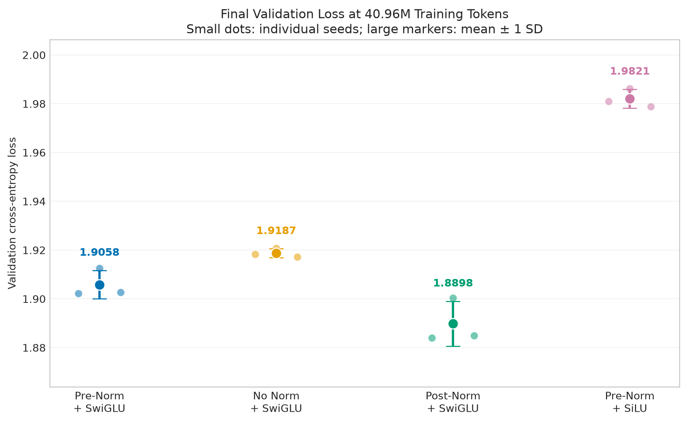

# Assignment 1 Transformer 消融实验报告

## 实验元信息

| 项目 | 内容 |
|---|---|
| 数据集 | TinyStories |
| 实验规模 | 4 个模型变体 × 3 个随机种子，共 12 次训练 |
| 随机种子 | 42、43、44 |
| 单次训练量 | 40.96M tokens（5000 steps） |
| 主要评价指标 | Final validation loss、perplexity、吞吐量、峰值显存 |
| 实验状态 | 12 次运行均已完成并同步至 W&B |
| 数据核验状态 | 已检查汇总脚本、曲线、最终结果图和各 seed 的成对差值；未进行独立的同 seed 重跑 |

## 1. 实验目标

本实验研究小规模 Transformer 在固定数据、训练预算和主体结构下，归一化方式与前馈网络结构对语言建模质量和运行效率的影响。具体回答两个问题：

1. Pre-Norm、Post-Norm 和不使用归一化在当前 4 层模型上有何差异？
2. 在总参数量基本匹配时，SwiGLU 的效果是否优于普通 SiLU 前馈网络？

实验以 **Pre-Norm + SwiGLU** 为基线。预期归一化位置会影响优化过程；如果 SwiGLU 的优势不仅来自参数量，那么参数匹配后的 SiLU 变体仍应表现出更高的验证损失。

## 2. 基线模型与控制变量

### 2.1 基线模型

基线模型采用 decoder-only Transformer：4 个 Transformer block，`d_model=512`，16 个注意力头，SwiGLU 隐藏维度为 1344。模型使用 Pre-Norm，即在 self-attention 和 FFN 子层之前应用 RMSNorm。

### 2.2 控制变量

| 类别 | 固定设置 |
|---|---|
| 训练数据 | 相同的 TinyStories 训练集与验证集二进制文件 |
| Tokenizer | 相同的 TinyStories Byte-level BPE tokenizer |
| 上下文长度 | 256 tokens |
| Batch size | 32 sequences，即每步 8192 tokens |
| 训练步数 | 5000 steps |
| 训练 token 数 | 40,960,000 |
| 模型深度与宽度 | 4 layers，`d_model=512`，16 heads |
| 优化方法 | 相同 AdamW 配置和学习率调度策略 |
| 验证频率 | 每 100 steps 验证一次 |
| 验证规模 | 每次 20 个 validation batches |
| 训练随机性 | 每个变体分别运行 seed 42、43、44 |
| 验证随机性 | 固定 `eval_seed=2026`，确保不同模型使用相同验证采样序列 |

一次训练只改变待研究的架构因素。训练质量以相同 token 预算下的 loss 比较，而不是以 wall-clock time 作为结束条件，从而避免吞吐量差异改变训练量。

## 3. 消融变量设计

| 变体 | 归一化 | FFN | FFN 隐藏维度 | 研究目的 |
|---|---|---|---:|---|
| `baseline` | Pre-Norm | SwiGLU | 1344 | 对照组 |
| `no_norm` | 无归一化 | SwiGLU | 1344 | 测量完全移除 RMSNorm 的影响 |
| `post_norm` | Post-Norm | SwiGLU | 1344 | 测量归一化位置的影响 |
| `silu_matched` | Pre-Norm | SiLU | 2016 | 在约 22.70M 参数下比较 SwiGLU 与普通 SiLU FFN |

`silu_matched` 将 `d_ff` 从 1344 增加到 2016，使其参数量与 22,696,448 参数的基线模型匹配。这样可以避免把 SwiGLU 与 SiLU 的差异简单归因于模型容量。

## 4. 实验结果

下表报告 3 个随机种子的均值与样本标准差（mean ± sample SD，`n=3`）。峰值显存保留到 3 位小数。

| 变体 | Final validation loss ↓ | Perplexity ↓ | 吞吐量（tokens/s）↑ | 峰值显存（GiB）↓ |
|---|---:|---:|---:|---:|
| `baseline` | 1.90582 ± 0.00583 | 6.72499 ± 0.03927 | 39,604 ± 499 | 3.992 |
| `no_norm` | 1.91874 ± 0.00179 | 6.81239 ± 0.01218 | 43,358 ± 1,868 | 3.710 |
| `post_norm` | **1.88980 ± 0.00923** | **6.61826 ± 0.06125** | 42,501 ± 31 | 3.991 |
| `silu_matched` | 1.98206 ± 0.00385 | 7.25772 ± 0.02798 | 42,764 ± 21 | 3.914 |

### 4.1 验证损失曲线



曲线由相同变体的 3 个 seed 聚合得到，实线表示均值，阴影表示跨 seed 的离散程度。所有变体的最佳 validation loss 均出现在 step 5000，当前预算内没有观察到验证损失反弹。

### 4.2 最终验证损失



小点是单次运行，较大的标记与误差棒表示均值 ± 1 个样本标准差。该图同时展示了中心趋势和单次运行差异，避免只报告表现最好的 seed。

### 4.3 相对基线的成对差值

同一 seed 内用变体结果减去基线结果，可以减少随机种子差异对对比的干扰。loss 差值小于 0 表示优于基线。

| 变体 | seed 42 | seed 43 | seed 44 | 平均差值 |
|---|---:|---:|---:|---:|
| `no_norm` | +0.01602 | +0.00816 | +0.01459 | +0.01292 |
| `post_norm` | -0.01830 | -0.01210 | -0.01765 | **-0.01601** |
| `silu_matched` | +0.07877 | +0.07377 | +0.07619 | +0.07624 |

三个 `post_norm` 运行均优于对应 seed 的基线；三个 `no_norm` 和 `silu_matched` 运行则均劣于对应基线。这里描述的是当前 3 对运行的一致方向，不等同于已经通过统计显著性检验。

## 5. 结果分析

### 5.1 Post-Norm 在当前设置下取得最低验证损失

`post_norm` 的平均 final validation loss 为 1.88980，比基线低 0.01601，约改善 0.84%；平均 perplexity 从 6.72499 降至 6.61826。三个随机种子均呈现相同方向，因此该结果不是由单个最佳运行造成的。

该结论仅适用于当前 TinyStories、4 层模型和 40.96M-token 训练预算。它不能推出 Post-Norm 在更深网络、更大数据集或更长训练中普遍优于 Pre-Norm。Pre-Norm 通常被用于改善深层网络的优化稳定性，而本实验模型较浅，没有触及这一使用场景。

### 5.2 移除归一化带来效率收益，但损害建模质量

`no_norm` 的平均 loss 比基线高 0.01292，perplexity 高 0.08740。与此同时，它的平均吞吐量比基线高约 9.5%，峰值显存低约 0.282 GiB。该变体省去了归一化计算和相应中间状态，因此存在可解释的效率收益，但在相同训练 token 数下没有达到基线的建模质量。

因此，无归一化并不是当前实验中的综合最优方案；它更接近“以部分质量换取速度和显存”的取舍点。

### 5.3 SwiGLU 的优势不能由参数量解释

参数匹配的 `silu_matched` 是四个变体中 validation loss 和 perplexity 最高的。其平均 loss 比基线高 0.07624，约恶化 4.0%，并且三个 seed 的差值非常接近。

因为 SiLU 变体已通过增加 `d_ff` 匹配基线参数量，这一结果支持如下解释：在当前设置中，SwiGLU 的门控结构比同参数规模的单路 SiLU FFN 更有效。该结论比较的是完整 FFN 结构，而不是孤立比较两个激活函数。

## 6. 训练稳定性与效率分析

### 6.1 训练稳定性

12 次运行均完成 5000 steps，未出现 NaN、loss 爆炸或提前终止。所有变体的最佳验证点都位于训练末尾，说明在当前预算下尚未观察到明显过拟合。由于训练仍在改善，延长训练可能改变变体之间的最终差距。

### 6.2 质量与吞吐量

按平均值计算，`post_norm` 同时取得更低 loss 和更高吞吐量，是当前测量中的最佳质量—效率点；`no_norm` 和 `silu_matched` 更快，但验证质量更差。

吞吐量结果应作为辅助指标解读。不同运行并非同时执行，GPU 温度、频率、后台负载和运行顺序都可能影响速度。特别是 `no_norm` 的吞吐量标准差明显高于其他变体，说明其均值受到跨运行波动影响。相比 wall-clock time，固定训练 token 数下的 validation loss 是更可靠的架构比较依据。

### 6.3 显存

`baseline` 与 `post_norm` 的峰值显存几乎相同，符合二者仅移动归一化位置的设计。`no_norm` 的峰值显存最低；`silu_matched` 虽增加了 FFN 隐藏宽度，但其非门控结构减少了一部分中间张量，峰值显存仍略低于基线。

## 7. 实验结论

| 研究问题 | 当前实验结论 | 证据强度 |
|---|---|---|
| 哪种归一化方式质量最好？ | Post-Norm 在 3 个 seed 上均取得更低 final validation loss | 中等：方向一致，但只有 3 个 seed 且模型较浅 |
| 可以完全移除归一化吗？ | 可以稳定完成训练并节省速度/显存，但验证质量下降 | 中等：质量方向一致，效率测量存在时序噪声 |
| SwiGLU 的收益是否只是参数更多？ | 不是；参数匹配的 SiLU FFN 仍明显更差 | 较强：差值较大且三个 seed 高度一致，但只覆盖一个数据集与规模 |

在本次 Assignment 1 的实验范围内，**Post-Norm + SwiGLU** 给出了最佳验证质量；**Pre-Norm + SwiGLU** 是稳定且表现接近的基线；移除归一化可换取一定运行效率；参数匹配的普通 SiLU FFN 没有复现 SwiGLU 的质量。

## 8. 局限性

1. 每个变体只有 3 个随机种子，适合报告均值、样本标准差和成对方向，但不足以支持强统计推断。
2. 实验只使用 TinyStories，没有在 OpenWebText 或其他更复杂语料上验证，因此结论可能依赖数据分布。
3. 模型只有 4 层。归一化方式在深层 Transformer 中的稳定性差异可能与本实验不同。
4. 所有最佳验证点均在 step 5000，说明当前训练预算可能尚未充分揭示长期收敛行为。
5. 吞吐量实验没有随机化运行顺序，也没有单独的硬件预热和多轮微基准，因此速度差异不能完全归因于架构。
6. 本轮只研究归一化和 FFN，未覆盖 RoPE/NoPE、学习率、权重衰减、batch size 等因素。
7. 固定 `eval_seed` 提高了不同模型之间的可比性，但每次只评估 20 个 batches，仍然是对完整验证集表现的有限估计。

## 9. 可复现性说明

为保证实验可追踪，训练脚本将模型、优化器、数据、seed 和消融变体写入每个 W&B run 的 config，并持续记录训练 loss、验证 loss、学习率、已处理 token 数、吞吐量和显存。每个正式变体运行 3 个预先指定的 seed，而不是只保留效果最好的结果。

汇总和绘图可由以下命令重新生成：

```bash
uv run python cs336_basics/summarize_ablations.py
uv run python cs336_basics/plot_ablations.py
```

复现实验时还应固定以下内容：

- 训练集、验证集和 tokenizer 文件及其版本；
- 当前 Git commit；
- Python、PyTorch、CUDA 与 GPU 型号；
- 每个 run 的完整 W&B config；
- `seed ∈ {42, 43, 44}` 与 `eval_seed=2026`；
- 40.96M-token 训练预算和相同验证采样策略。

本报告的“已核验”表示现有 12 个运行的结果已被汇总和交叉检查，不表示已在另一台设备上完成独立复现。

## 10. W&B 与本地产物

### 10.1 W&B

- Project：[assignment1-ablations](https://wandb.ai/2369897653-private/assignment1-ablations)
- 正式运行数：12
- 主要面板：validation loss vs. tokens、train loss、quality–efficiency、quality–memory
- 分组字段：`config.variant`

### 10.2 本地产物

| 产物 | 用途 |
|---|---|
| [metrics_summary.md](metrics_summary.md) | 四个变体的聚合结果与逐 seed 差值 |
| [validation_loss_curves.png](validation_loss_curves.png) | 验证损失随训练 token 数变化的聚合曲线 |
| [final_validation_loss.png](final_validation_loss.png) | 最终 loss、单 seed 点和均值 ± 1 SD |
| [summarize_ablations.py](../../../cs336_basics/summarize_ablations.py) | 从正式运行目录汇总指标 |
| [plot_ablations.py](../../../cs336_basics/plot_ablations.py) | 生成实验图表 |

## 总结

本实验通过 4 个受控架构变体、3 个固定随机种子和统一的 40.96M-token 预算，将“实现一个 Transformer”扩展为“用可复现证据比较 Transformer 设计选择”。结果显示，当前浅层 TinyStories 模型中 Post-Norm 的验证质量最好，而参数匹配的 SiLU FFN 明显落后于 SwiGLU。实验同时保留了原始运行、W&B 配置、聚合脚本和图表，使结论能够回溯到单次运行，而不是停留在单个 loss 数字上。
