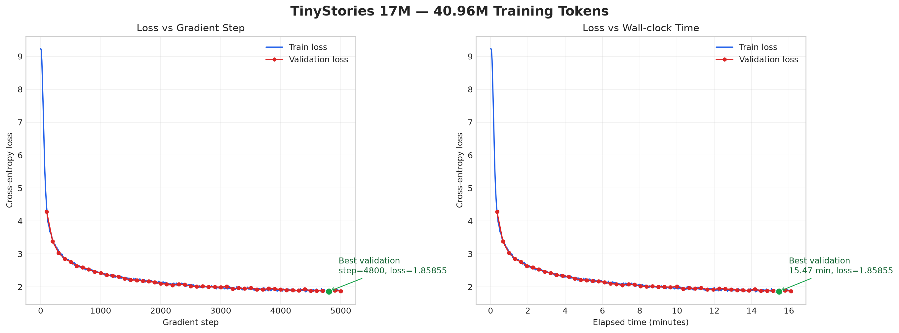

# TinyStories 5K 语言模型训练实验报告

## 1. 实验概述

本实验从头实现并训练一个基于 Transformer 的自回归语言模型，用于学习 TinyStories 数据集中的英文短故事。实验覆盖数据预处理、BPE Tokenizer、模型训练、验证评估、checkpoint 保存、学习曲线绘制和文本生成等完整流程。

本次正式实验只使用 TinyStories，没有训练 OpenWebText。模型共训练 5000 个梯度更新步骤，处理 40,960,000 个 token。

## 2. 实验环境

| 项目 | 配置 |
| --- | --- |
| 操作环境 | WSL2 Ubuntu / Linux 6.18.33.2 |
| Python | 3.13.14 |
| PyTorch | 2.11.0+cu130 |
| CUDA Runtime | 13.0 |
| GPU | NVIDIA GeForce RTX 5060 |
| GPU 显存 | 8151 MiB |
| 归档前 Git commit | `938e49c44c5ccf6a07aed944be83715b8846531b` |
| 实验时间 | 2026-08-06 |

## 3. 数据与 Tokenizer

| 项目 | 配置 |
| --- | --- |
| 训练数据 | `data/tinystories_train.uint16.bin` |
| 验证数据 | `data/tinystories_valid.uint16.bin` |
| 数据类型 | `uint16` |
| Tokenizer | 在 TinyStories 上训练的 BPE Tokenizer |
| 词表文件 | `artifacts/tinystories_bpe/vocab.json` |
| 合并规则 | `artifacts/tinystories_bpe/merges.json` |
| 词表大小 | 10,000 |

使用 `uint16` 保存 token ID 是合适的，因为词表大小为 10,000，远小于 `uint16` 可表示的最大值 65,535。与使用 `int32` 或 `int64` 相比，这能够减小磁盘占用和数据读取压力。

## 4. 模型配置

| 超参数 | 数值 |
| --- | ---: |
| 上下文长度 | 256 |
| `d_model` | 512 |
| Transformer 层数 | 4 |
| 注意力头数 | 16 |
| `d_ff` | 1344 |
| RoPE `theta` | 10,000 |
| 实测参数量 | 22,696,448 |

参数量通过读取最终 checkpoint 中的 `model_state_dict` 并对所有张量的元素数量求和得到，因此比根据结构进行口头估算更可靠。

## 5. 训练配置

| 超参数 | 数值 |
| --- | ---: |
| 优化器 | AdamW |
| Batch size | 32 |
| 每个 batch 的序列长度 | 256 |
| 每步 token 数 | 8192 |
| 最大训练步数 | 5000 |
| 总训练 token 数 | 40,960,000 |
| 最大学习率 | 0.0003 |
| 最小学习率 | 0.00003 |
| Warmup 步数 | 100 |
| `beta1` | 0.9 |
| `beta2` | 0.95 |
| `eps` | 1e-8 |
| Weight decay | 0.1 |
| 梯度裁剪阈值 | 1.0 |
| 验证间隔 | 100 步 |
| 每次验证 batch 数 | 20 |
| Checkpoint 间隔 | 500 步 |
| 随机种子 | 42 |

学习率先经过 100 步线性 warmup，然后按照余弦退火逐渐从最大学习率下降到最小学习率。Warmup 可以降低训练早期参数更新过大的风险；余弦退火则让训练后期使用更小的步长进行细化。

## 6. 实验结果

### 6.1 总体结果

| 指标 | 结果 |
| --- | ---: |
| 最终训练 loss | 1.860546 |
| 最终验证 loss | 1.868567 |
| 最终验证 perplexity | 6.479006 |
| 最佳验证 step | 4800 |
| 最佳验证 loss | 1.858549 |
| 最佳验证 perplexity | 6.414426 |
| 最佳点出现时间 | 927.93 秒（15.47 分钟） |
| 总训练与验证耗时 | 966.33 秒（16.11 分钟） |
| 最终记录吞吐量 | 42,436 tokens/s |

最佳验证结果出现在 step 4800，而不是最后一步。最终 step 5000 的验证 loss 只比最佳值高约 0.010，属于训练后期的小幅波动。若用于部署或生成，应该优先选择验证 loss 最低的 step 4800 checkpoint；本实验目前归档和验证的是 step 5000 checkpoint。

### 6.2 关键验证点

| Step | Validation loss | Perplexity |
| ---: | ---: | ---: |
| 100 | 4.280398 | 72.269210 |
| 500 | 2.758453 | 15.775422 |
| 1000 | 2.420526 | 11.251771 |
| 2000 | 2.099923 | 8.165540 |
| 3000 | 1.990802 | 7.321403 |
| 4000 | 1.919326 | 6.816360 |
| 5000 | 1.868567 | 6.479006 |

### 6.3 学习曲线



训练初期 loss 下降很快，说明模型首先学会了高频词、基础句法和 TinyStories 中反复出现的简单叙事模式。随着容易学习的规律逐渐被掌握，后续优化转向更细致的词语搭配和上下文关系，因此 loss 的下降速度逐渐变慢，表现出明显的边际收益递减。

训练 loss 与验证 loss 整体同步下降，而且二者没有持续拉开，说明在 5000 步范围内没有明显过拟合。step 4800 后验证 loss 略微回升，但幅度很小，暂时更适合解释为随机 batch、随机采样和有限验证集估计带来的正常波动，不能仅凭这一个点断言模型已经开始严重过拟合。

## 7. 文本生成验证

使用以下配置从 step 5000 checkpoint 生成文本：

| 参数 | 数值 |
| --- | ---: |
| Prompt | `Once upon a time, there was a little girl named Lily.` |
| 最大新 token 数 | 96 |
| Temperature | 0.8 |
| Top-p | 0.9 |
| Seed | 42 |
| Device | CUDA |

真实生成结果如下：

> Once upon a time, there was a little girl named Lily. She had a big box of toys. She loved to play with them all day.
> One day, Lily's mommy said, "Lily, let's cook a cake!" Lily was very happy and they both looked at the cake. They were so excited to eat it.
> But then, Lily's mommy came into the kitchen. She saw the cake and said, "Lily, what did you do now?" Lily said, "I found a cake for my birthday party.

生成文本具有以下特点：

- 能延续 prompt 中的人物 Lily，并保持儿童故事的语气。
- 句法和局部衔接基本正确，能够生成角色、事件与对话。
- 存在情节一致性问题：母亲已经和 Lily 一起看蛋糕，后面却又写成母亲刚进入厨房。
- 最后一句引号没有闭合，这是达到最大生成长度后被截断造成的，不一定代表模型不会输出闭合引号。
- 结果表明模型已经学会 TinyStories 的表面文体和短距离关系，但较长范围的情节规划仍然有限。

## 8. 可复现命令

### 8.1 训练

```bash
uv run python -m cs336_basics.train \
  --train-data data/tinystories_train.uint16.bin \
  --validation-data data/tinystories_valid.uint16.bin \
  --checkpoint-dir artifacts/tinystories_checkpoints \
  --log-file artifacts/tinystories_metrics.jsonl \
  --vocab-size 10000 \
  --context-length 256 \
  --d-model 512 \
  --num-layers 4 \
  --num-heads 16 \
  --d-ff 1344 \
  --rope-theta 10000 \
  --batch-size 32 \
  --max-iters 5000 \
  --warmup-iters 100 \
  --max-learning-rate 3e-4 \
  --min-learning-rate 3e-5 \
  --beta1 0.9 \
  --beta2 0.95 \
  --weight-decay 0.1 \
  --max-grad-norm 1.0 \
  --device cuda
```

### 8.2 绘制曲线

```bash
uv run python -m cs336_basics.plot_metrics \
  --metrics artifacts/experiments/tinystories_5k_20260806/metrics.jsonl \
  --output artifacts/experiments/tinystories_5k_20260806/learning_curves.png \
  --title "TinyStories 5K Training Run"
```

### 8.3 文本生成

```bash
uv run python -m cs336_basics.generate \
  --checkpoint artifacts/tinystories_checkpoints/step_0005000.pt \
  --config artifacts/experiments/tinystories_5k_20260806/run_config.json \
  --prompt "Once upon a time, there was a little girl named Lily." \
  --max-new-tokens 96 \
  --temperature 0.8 \
  --top-p 0.9 \
  --seed 42 \
  --device cuda
```

## 9. 实验产物

| 产物 | 路径 |
| --- | --- |
| 实验配置 | `run_config.json` |
| 指标日志 | `metrics.jsonl` |
| 学习曲线 | `learning_curves.png` |
| 环境信息 | `environment.txt` |
| 原始训练命令 | `train_command.txt` |
| 最终 checkpoint | `../../tinystories_checkpoints/step_0005000.pt` |

最终 checkpoint 的 SHA256 为：

```text
4beb0b46dbd1f5d4120beae48a9c0851a68b174579e355a0ace275442819e50b
```

## 10. 局限与后续改进

| 当前局限 | 后续可做的实验 |
| --- | --- |
| 只进行了一次随机种子为 42 的正式训练 | 使用多个随机种子，报告均值和方差 |
| 只训练 5000 步 | 延长训练并观察验证 loss 是否继续下降 |
| 上下文长度只有 256 | 对比更长上下文对情节一致性的影响 |
| 只使用 TinyStories | 在资源允许时对比更复杂的语料 |
| 只用 loss、perplexity 和单个生成样例评估 | 增加多 prompt 人工评估、重复率和多样性统计 |
| 只归档了最终 checkpoint 的完整验证信息 | 后续训练自动单独保存 best-validation checkpoint |

优先级最高的工程改进是：验证 loss 创下新低时自动保存 `best.pt`。这样即使后续训练出现波动，也能直接保留泛化效果最好的模型，而不必只依赖最后一步。

## 11. 结论

本实验成功完成了 TinyStories 小型语言模型从数据到生成的端到端流程。22,696,448 参数的 Transformer 在 5000 步、约 4096 万训练 token 后，取得了 1.858549 的最佳验证 loss 和 6.414426 的最佳 perplexity。学习曲线显示模型稳定收敛且没有明显过拟合，生成结果也已经具备基础英文语法、儿童故事文体和局部情节结构。

与此同时，生成文本仍存在长距离情节矛盾，说明较低的 token-level loss 并不等同于完整的故事规划能力。后续应同时关注验证指标、生成质量和 checkpoint 选择机制，而不是只观察最终训练 loss。
